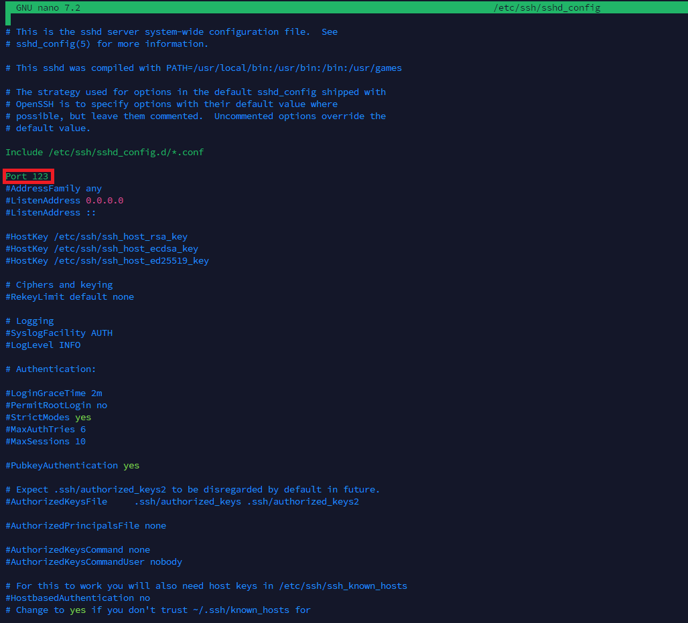

# install.md
---
> Documentation à destination des développeurs pour l'installation et la configuration du serveur.

## **Configuration du server-mumble.ini**
`sudo nano /etc/mumble-server.ini`

**1.  Modification du port de connexion au serveut mumble**
**2. Modification de mot de passe pour se connecter au serveur Mumble**
**3. Maximum d'utilisateur autoriser en meme temps sur le serveur**
**4. utilisateur maximum par channel (0 etant une no limit)**

---
## **Configuration du serveur ssh**
`sudo nano /etc/ssh/sshd_config`

>dans l'encart présentée ci-dessus vous pouvez modifier le port de connexion au serveur ssh 
---

**5. Choix du salon par defaut lors de la permiere entrée dans le serveur**

---
## **Configuration mumble-server.log**
`root@flosh:~# sudo nano /var/log/mumble-server/mumble-server.log`

**1. Configuration du mot de passe du SuperUser**
>Si le mot de passe a été changer, que vous ne pouvez pas vous connecter et que l'ancien mot de passe n'a pas été écrit quelque part utilisée cette commande :
`sudo murmurd -supw <pw>`
`sudo murmurd -ini /etc/mumble-server.ini`
Remplacer `<pw>` par ce que vous désirez mettre en mot de passe pour l'utilisateur "SuperUser".

Si vous decendez plus bas vous pouvez voir les "logs" du serveur.

---
## Mumble-server.sqlite
`root@flosh:~# sudo nano /var/lib/mumble-server.sqlite`

>**Clé privée RSA**
La clé privée RSA correspond à la clé secrète associée au certificat public.
Elle est utilisée pour :
Déchiffrer les messages chiffrés par le client avec la clé publique.
Signer des communications, garantissant qu'elles proviennent du serveur authentique.
**Important :** Cette clé doit être gardée secrète. Si elle est compromise, un tiers pourrait intercepter ou usurper les communications.

>**Certificat RSA**
Le certificat RSA est un fichier contenant une clé publique qui identifie le serveur de manière sécurisée.
Il est utilisé pour établir des connexions chiffrées entre les clients Mumble et le serveur Murmur.
Lorsqu'un client se connecte, le serveur utilise ce certificat pour prouver son identité et permettre le chiffrement de la communication.

Ce fichiée contient aussi :
* 1.Utilisateurs et Identifiants
    * Liste des utilisateurs enregistrés.
    * Informations d'identification des utilisateurs : noms, certificats, mots de passe hachés (si activés).
    * Statistiques sur les connexions (nombre de connexions, dernières connexions, etc.).
* 2.Canaux
    * Structure des canaux créés sur le serveur.
    * Permissions et hiérarchies spécifiques aux canaux.
* 3.Permissions et Groupes
    * Droits d'accès pour les utilisateurs ou groupes à différents canaux.
    * Groupes personnalisés et leurs permissions associées.
* 4.Banlist
    * Liste des utilisateurs bannis, basée sur leur IP ou certificat.
    * Raison et durée des bannissements.
* 5.Configuration spécifique au serveur
    * Paramètres persistants spécifiques à l'instance du serveur.
    * Préférences définies via l'interface ou les commandes administratives.
* 6.Logs
    * Journaux d'événements (selon la configuration, les logs peuvent être stockés ici).

---
