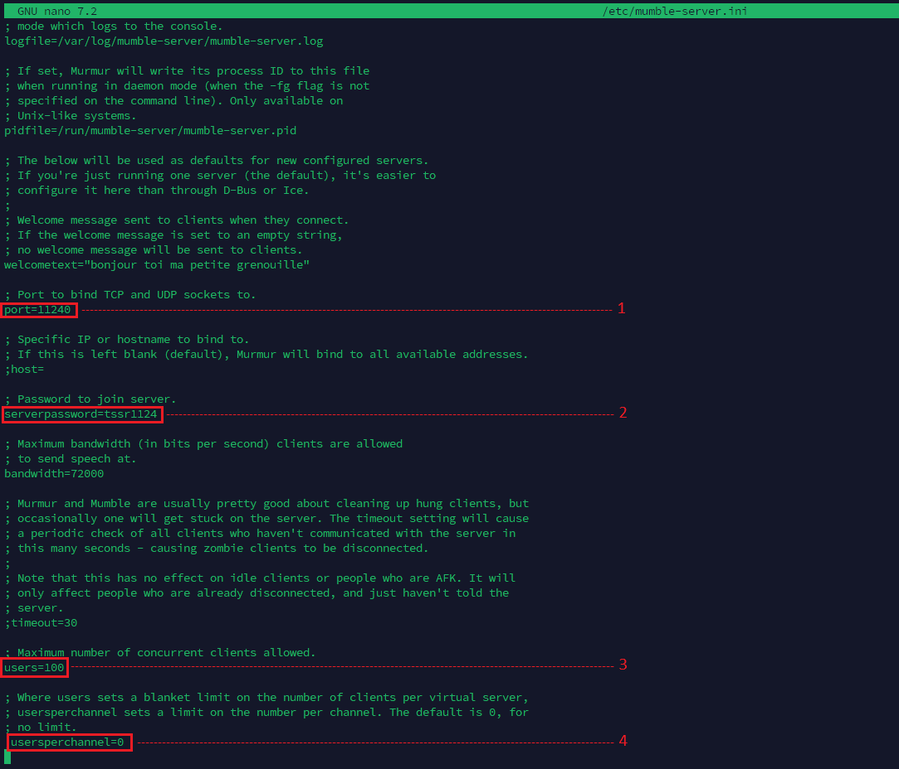
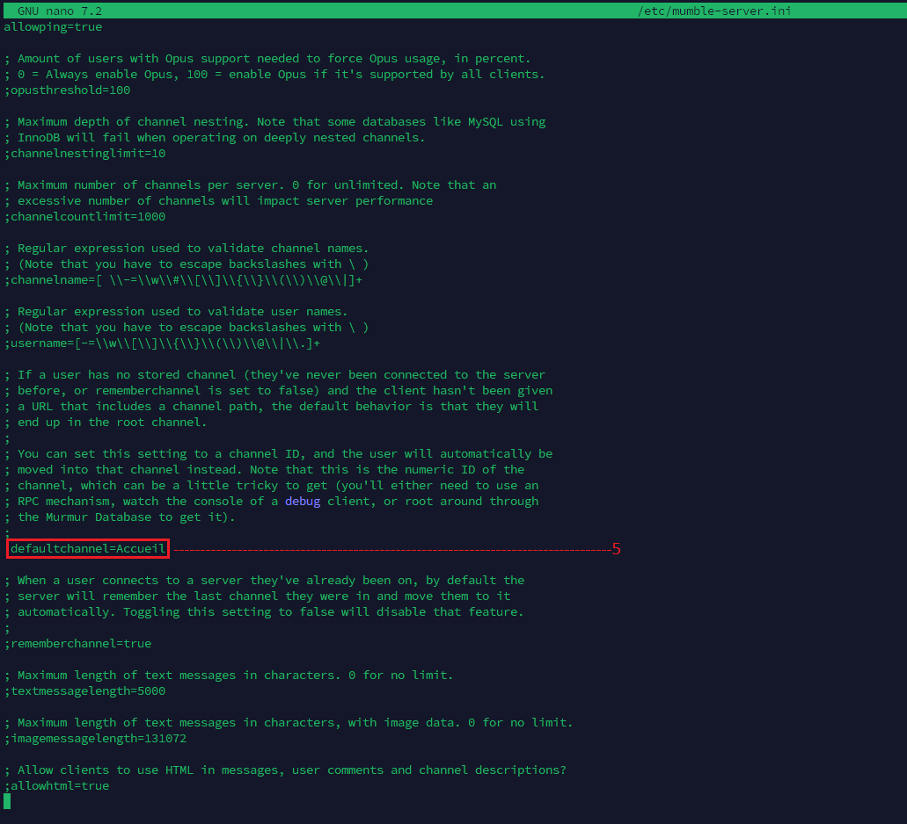
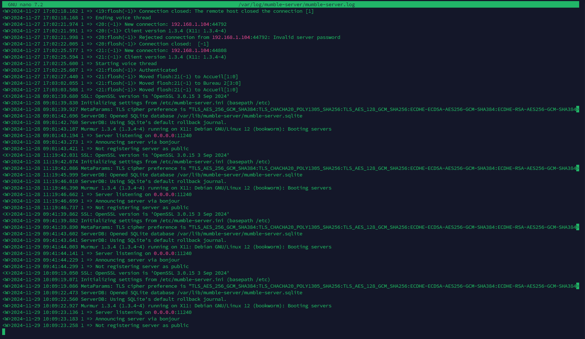
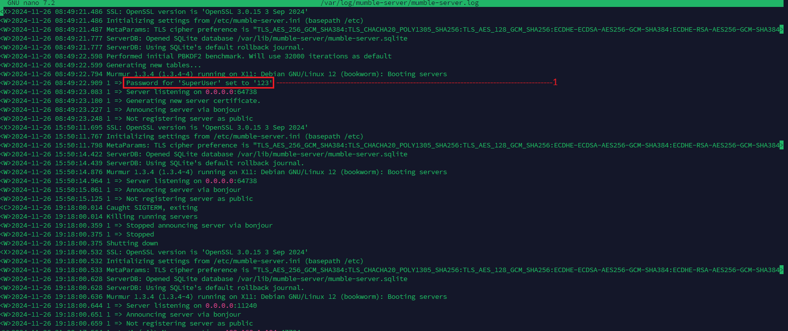
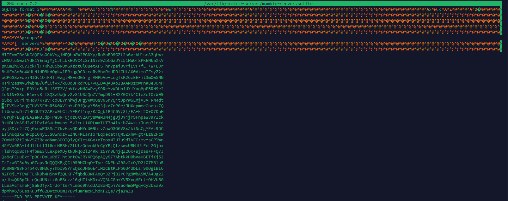
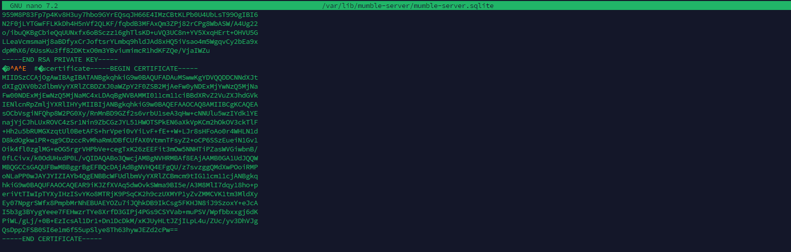
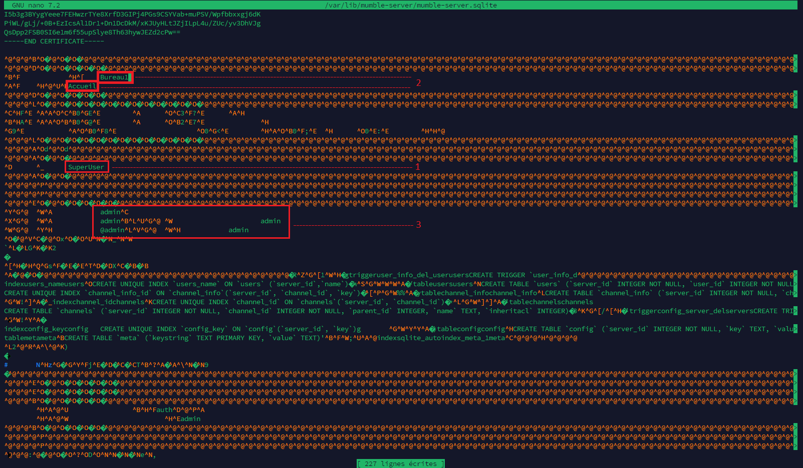

# Install.md
---
### 📋 **Sommaire**

   * **Introduction**
   * **Mise à jour des packets et installation du serveur Mumble**
   * **Configuration du fichier `mumble-server.ini`**
       * Modification du port de connexion
       * Modification du mot de passe
       * Limitation du nombre d'utilisateurs
       * Limitation des utilisateurs par canal
       * Choix du salon par défaut
   * **Configuration du serveur SSH**
       * Modification du port SSH
   * **Configuration du fichier de logs `mumble-server.log`**
       * Modification du mot de passe SuperUser
       * Lecture des logs
   * **Base de données `mumble-server.sqlite`**
       * Clé privée RSA
       * Certificat RSA
       * Autres informations contenues dans la base

###  **Introduction**

Ce document guide les développeurs à travers le processus d'installation et de configuration d'un serveur Mumble. Il couvre les principaux fichiers de configuration et explique leurs rôles.

---

## Mettre à jour la machine Debian 12 
`sudo apt update && sudo apt upgrade -y`


## Installer le serveur Mumble 
`sudo apt install mumble-server -y`

---

## **Configuration du fichier `mumble-server.ini`**

Le fichier `mumble-server.ini` contient les paramètres de configuration principaux du serveur Mumble. Pour le modifier, utilisez l'éditeur de texte `nano` :

`sudo nano /etc/mumble-server.ini`




-  1. **Modification du port de connexion au serveur Mumble** : Modifiez la valeur associée à la clé `port=` pour spécifier un port différent.
-  2. **Modification de mot de passe pour se connecter au serveur Mumble** : Modifiez la valeur associée à la clé `serverpassword=` pour définir un nouveau mot de passe.
-  3. **Maximum d'utilisateur autorisés en meme temps sur le serveur** : Modifiez la valeur associée à la clé `maxusers=` pour limiter le nombre d'utilisateurs simultanés.
-  4. **Utilisateur maximum par channel (0 etant une no limit)** : Modifiez la valeur associée à la clé `channel_user_limit=` pour définir une limite par canal.
-  5. **Choix du salon par defaut lors de la première entrée dans le serveur** : Modifiez la valeur associée à la clé `default_channel=` pour spécifier le canal par défaut.


---

## **Configuration du serveur ssh**
`sudo nano /etc/ssh/sshd_config`


Pour modifier le port d'écoute du serveur SSH, modifiez le fichier `sshd_config` :

```bash
sudo nano /etc/ssh/sshd_config
```

Modifiez la ligne `Port` pour spécifier le nouveau numéro de port.

---

## **Affichage du fichier de logs `mumble-server.log`**
`sudo nano /var/log/mumble-server/mumble-server.log`



### **1. Configuration du mot de passe du SuperUser**



>Si le mot de passe a été changer, que vous ne pouvez pas vous connecter et que l'ancien mot de passe n'a pas été écrit quelque part utilisée cette commande :
`sudo murmurd -supw <pw>`
`sudo murmurd -ini /etc/mumble-server.ini`
Remplacer `<pw>` par ce que vous désirez mettre en mot de passe pour l'utilisateur "SuperUser".

---

### **Base de données `mumble-server.sqlite`**
Pour y accéder utilisez la commande
`sudo nano /var/lib/mumble-server.sqlite`

La base de données `mumble-server.sqlite` stocke les informations sur les utilisateurs, les canaux, les permissions et d'autres paramètres du serveur. **Attention :** Ne modifiez pas cette base de données manuellement, sauf si vous savez exactement ce que vous faites.

**Important :** Sauvegardez régulièrement la base de données pour éviter toute perte de données en cas de problème.


* **Clé privée RSA** : Clé secrète utilisée pour chiffrer les communications.
  La clé privée RSA correspond à la clé secrète associée au certificat public.
Elle est utilisée pour :
Déchiffrer les messages chiffrés par le client avec la clé publique.
Signer des communications, garantissant qu'elles proviennent du serveur authentique.
**Important :** Cette clé doit être gardée secrète. Si elle est compromise, un tiers pourrait intercepter ou usurper les communications.




* **Certificat RSA** : Clé publique utilisée pour vérifier l'identité du serveur.
Le certificat RSA est un fichier contenant une clé publique qui identifie le serveur de manière sécurisée.
Il est utilisé pour établir des connexions chiffrées entre les clients Mumble et le serveur Murmur.
Lorsqu'un client se connecte, le serveur utilise ce certificat pour prouver son identité et permettre le chiffrement de la communication.




* **Autres informations** : Utilisateurs enregistrés, canaux, permissions, etc.


Ce fichiée contient aussi :
* 1.Utilisateurs et Identifiants
    * Liste des utilisateurs enregistrés.
    * Informations d'identification des utilisateurs : noms, certificats, mots de passe hachés (si activés).
    * Statistiques sur les connexions (nombre de connexions, dernières connexions, etc.).
* 2.Canaux
    * Structure des canaux créés sur le serveur.
    * Permissions et hiérarchies spécifiques aux canaux.
* 3.Permissions et Groupes
    * Droits d'accès pour les utilisateurs ou groupes à différents canaux.
    * Groupes personnalisés et leurs permissions associées.
* 4.Banlist
    * Liste des utilisateurs bannis, basée sur leur IP ou certificat.
    * Raison et durée des bannissements.
* 5.Configuration spécifique au serveur
    * Paramètres persistants spécifiques à l'instance du serveur.
    * Préférences définies via l'interface ou les commandes administratives.
* 6.Logs
    * Journaux d'événements (selon la configuration, les logs peuvent être stockés ici).


---
