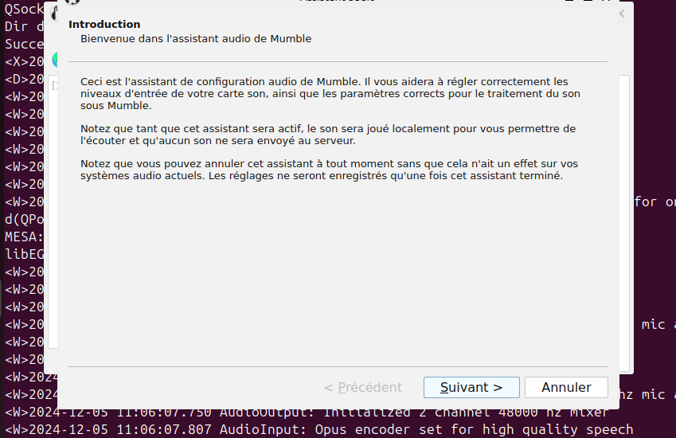

# **Voici un tutoriel général, pour installer le logiciel Mumble sur un poste client, adapté à différents systèmes d'exploitation :**

# **Sommaire**

Ce tutoriel t'explique comment installer Mumble sur ton ordinateur.

   - Télécharger Mumble : Où trouver le logiciel et quelle version choisir.
   - Installer Mumble : Les étapes simples pour installer Mumble sur Windows, macOS ou Linux.
   - Configurer Mumble : Comment te connecter à un serveur, choisir un nom d'utilisateur et régler ton micro.
   - En bref, ce guide te permet d'utiliser Mumble en quelques minutes.

### Téléchargement du client Mumble

1. **Visitez le site officiel de Mumble:** Rendez-vous sur https://www.mumble.info/downloads/.
2. **Choisissez votre système d'exploitation:** Sélectionnez la version de Mumble compatible avec votre système (Windows, macOS, Linux).
3. **Téléchargez le fichier d'installation:** Cliquez sur le lien de téléchargement correspondant à votre système.

### Installation du client

**Windows:**

- **Double-cliquez** sur le fichier téléchargé.
- **Suivez les instructions à l'écran:** Cliquez sur "Suivant" pour accepter les termes du contrat de licence et choisir le dossier d'installation.
- **Lancez Mumble:** Une fois l'installation terminée, vous pouvez lancer Mumble depuis le menu Démarrer.

**macOS:**

- **Double-cliquez** sur le fichier téléchargé (fichier .dmg).
- **Faites glisser l'icône Mumble** dans le dossier Applications.
- **Lancez Mumble:** Ouvrez le dossier Applications et double-cliquez sur l'icône Mumble.

**Linux:**

- **Ouvrez le magazin d'application**

- **Recherchez Mumble dans le magazin d'applications** 

- **Cliquez sur le bouton "Installer"**

- **Une fois l'installation terminée, cliquez sur le bouton "Ouvrir"**

- **Ensuite, suivez le processus de configuration initial**

### Configuration initiale

- **Connexion au serveur:** Dans la fenêtre Mumble, entrez l'adresse du serveur auquel vous souhaitez vous connecter (fournie par l'administrateur du serveur).

- **Identifiants:** Choisissez un nom d'utilisateur et, si nécessaire, un mot de passe.

- **Configuration audio:** Mumble vous guidera pour configurer votre microphone et vos haut-parleurs.

**Conseils supplémentaires:**

- **Mise à jour:** Vérifiez régulièrement les mises à jour de Mumble pour bénéficier des dernières fonctionnalités et améliorations de sécurité.
- **Plugins:** Mumble propose une variété de plugins qui peuvent étendre ses fonctionnalités. Vous pouvez les installer en suivant les instructions spécifiques à chaque plugin.
- **Configuration avancée:** Pour une configuration plus avancée (qualité audio, canaux personnalisés, etc.), consultez la documentation officielle de Mumble.
